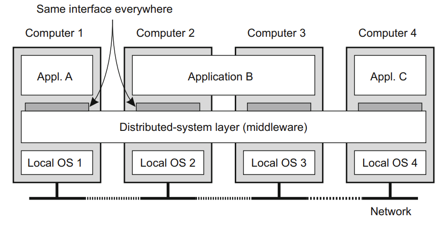

---

layout:     post
title:      literature notes
subtitle:   "A brief introduction to distributed systems"
date:       2023-05-21
author:     Ryan
header-img: img/post-bg-re-vs-ng2.jpg
catalog: true
tags:

    - distributed system
    - literature note

---


*This paper mainly talks about distributed systems. The authors provide an overview of distributed systems,  perfect for anyone who are new to distributed systems.*  

***


<center>Fig.1 outline</center>

In the first part of the paper,  the authors briefly review the evolution of computing and point out two technical foundations of distributed systems: the development of powerful microprocessors and the invention of high-speed computer networks. Why are these technologies important?

> The result of these technologies is that it is now not only feasible, but easy, to put together a computing system composed of many networked computers, be they large or small.

# 1 What is a distributed system?

## a loose definition of distributed systems:

> *A distributed system is **a collection of autonomous computing elements** that appears to its users as **a single coherent system**.*

  Notice that there are two characteristic features.

## Characteristic 1: a collection of autonomous computing elements

* Every computing element (as a node) can act independently from each other. Nodes in a collection could be different from each other (ranging from very big high-performance computers to small plug computers or even smaller devices).
* They have to communicate and coordinate their actions to achieve a common goal. 

To achieve this characteristic, we have to think about how to manage the membership and how to deal with the lack of a common reference of time.

## Characteristic 2: a single coherent system

> in a single coherent system the collection of nodes as a whole operates the same, no matter where, when, and how interaction between a user and the system takes place.

* an important design goal: distribution transparency.  The detail is in the next section.

## A distributed system organized as middleware

> To assist the development of distributed applications, distributed systems are often organized to have a separate layer of software that is logically placed on top of the respective operating systems of the computers that are part of the system. This organization is shown in Fig.



<center>Fig.2 middleware(from "A brief introduction to distributed systems")</center>

#####   It offers services as follows:

* resource management
* Facilities for interapplication communication
* Security services
* Accounting services
* Masking of and recovery from failures

# 2 Design goals

> A distributed system should make resources easily accessible; it should hide the fact that resources are distributed across a network; it should be open; and it should be scalable.

## 1）Supporting resource sharing

Resources can be virtually anything, but typical examples include peripherals, storage facilities, data, files, services, and networks, to name just a few.

By supporting resource sharing, it helps to reduce costs and facilitate cooperation between different nodes.

## 2）Making distribution transparent

There are seven types of distribution transparency.

| Transparency |                         Description                          |
| :----------: | :----------------------------------------------------------: |
|    Access    | Hide differences in data representation and how an object is accessed |
|   Location   | Hide where an object is located(often achieved by assigning only logical names to resources) |
|  Relocation  | Hide that an object may be moved to another location while in use (which is becoming increasingly important in the context of cloud computing) |
|  Migration   | Hide that an object may move to another location (it supports the mobility of processes and resources initiated by users, without affecting ongoing communication and operations.) |
| Replication  |              Hide that an object is replicated               |
| Concurrency  | Hide that an object may be shared by several independent users (be achieved through locking mechanisms) |
|   Failure    |          Hide the failure and recovery of an object          |

For distinguishing between relocation and migration transparent, there are two examples that could help to understand:

* Relocation transparent:  the entire site may have been moved from one data center to another to make more efficient use of disk space, yet users should not notice.
* Migration transparent: Communication between mobile phones-regardless whether two people are actually moving, mobile phones will allow them to continue their conversation.

**Attempting to blindly hide all distribution aspects from users is not a good idea. ** Full distribution transparency can never be achieved. There is also a trade-off between a high degree of transparency and the performance of a system.

> The conclusion is that aiming for distribution transparency may be a nice goal when designing and implementing distributed systems, but that it should be considered together with other issues such as performance and comprehensibility. The price for achieving full transparency may be surprisingly high.

## 3）Being open

* Interoperability

* Composability

* Extensibility

```

```


## 4）Being scalable


# 3 types of distributed systems


# 4 outlook

