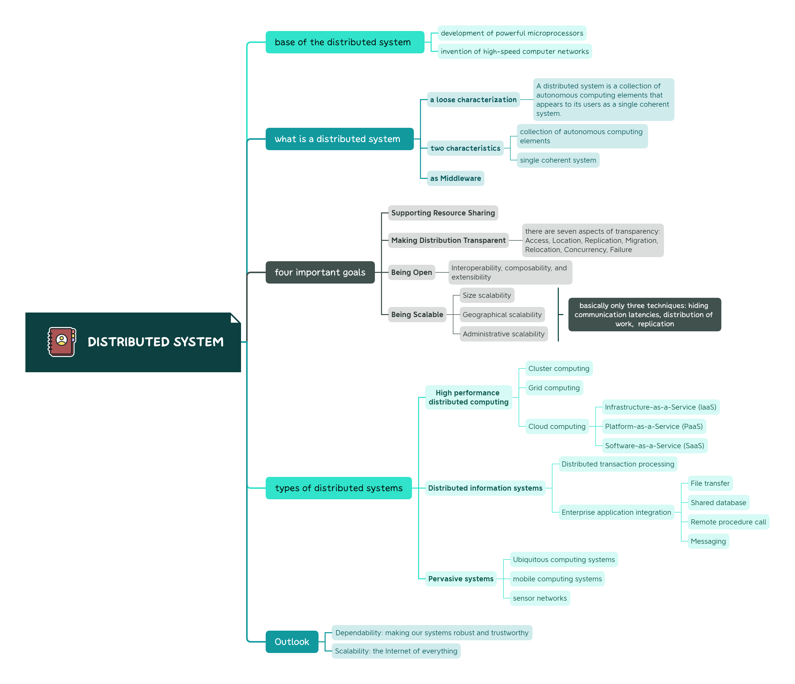

---

layout:     post
title:      literature notes
subtitle:   "A brief introduction to distributed systems"
date:       2023-05-21
author:     Ryan
header-img: img/post-bg-re-vs-ng2.jpg
catalog: true
tags:

    - distributed system
    - literature note

---

*This paper mainly talks about distributed systems. The authors provide an overview of distributed systems,  perfect for anyone who are new to distributed systems.*  

***

Fig.1 outline

In the first part of the paper,  the authors briefly review the evolution of computing and point out two technical foundations of distributed systems: the development of powerful microprocessors and the invention of high-speed computer networks. Why are these technologies important?

> *"The result of these technologies is that it is now not only feasible, but easy, to put together a computing system composed of many networked computers, be they large or small."*

# What is a distributed system?

## a loose definition of distributed systems:

> *A distributed system is **a collection of autonomous computing elements** that appears to its users as **a single coherent system**.*

Notice that there are two characteristic features

